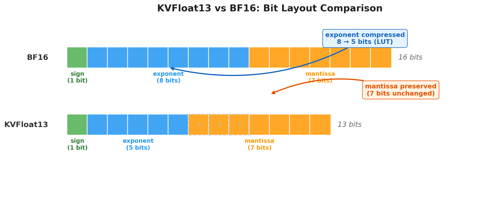
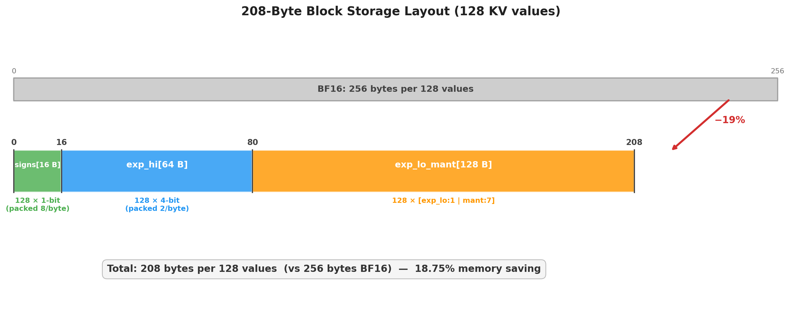
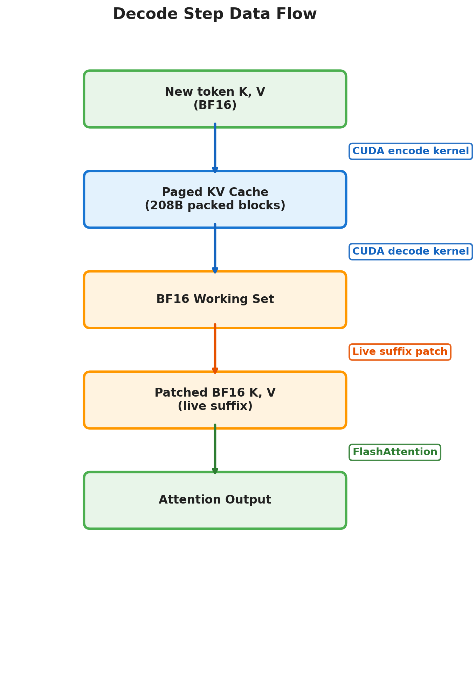
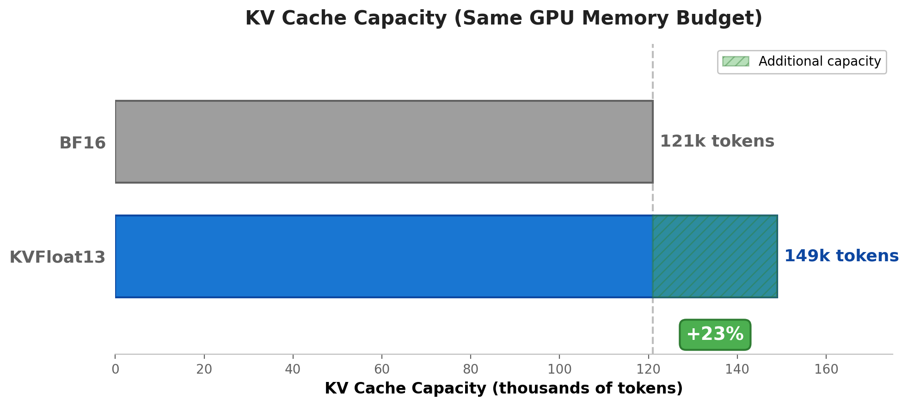
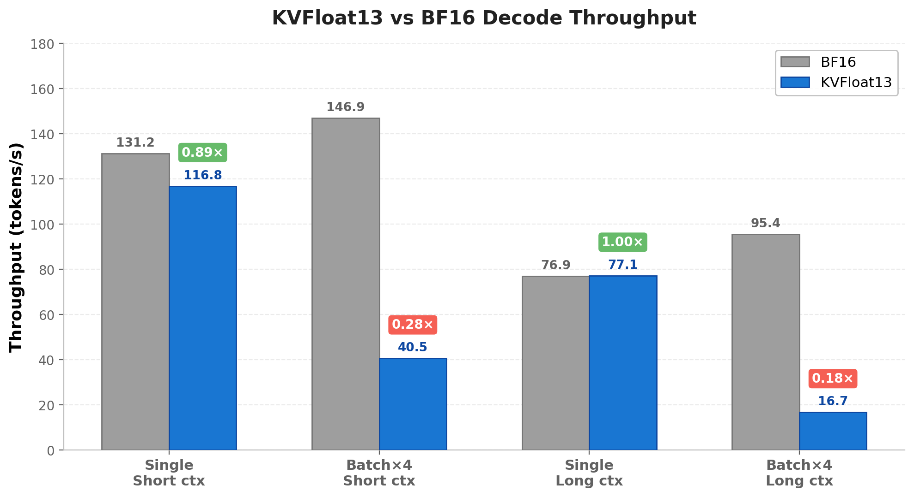

# KVFloat13 for KV Cache: Technical Report

## 1. 概述

本文档总结一种面向大语言模型推理阶段 KV cache 的定长压缩格式 `KVFloat13`，以及该格式在 vLLM 原型中的集成方式、存储布局、编解码机制、运行时路径、性能表现和已知限制。

`KVFloat13` 的目标不是替代权重量化，而是专门用于 **KV cache 的存储压缩**。它的设计重点是：

1. 固定长度块存储，适合 paged KV cache；
2. 用一个很小的固定指数表覆盖 BF16 KV cache 中最常见的指数带；
3. 保留原始 `sign` 和 `mantissa`，只压缩 exponent 表示；
4. 支持 GPU 友好的 update / decode / working-set 管线；
5. 能接入现有 vLLM + FlashAttention 的推理栈。

`KVFloat13` 在逻辑上可写为：

- `sign(1) + exp(5) + mantissa(7) = 13 bits`

相对于 BF16 的：

- `sign(1) + exp(8) + mantissa(7) = 16 bits`

其核心思想是：**不改变尾数位宽，只把 BF16 的 8-bit exponent 压缩为 5-bit 索引**。

---

## 2. 问题背景

在 Transformer 大语言模型推理中，KV cache 往往随着上下文长度线性增长，并直接决定：

1. 最大上下文长度；
2. 并发请求数；
3. batch size；
4. 服务端显存成本。

如果直接使用 BF16 存储：

- 精度稳定；
- 但显存占用高；
- 在长上下文服务中很快成为瓶颈。

另一方面，通用的更激进量化格式虽然压缩率更高，但常常会带来两个问题：

1. 页大小不再规则，难接入 paged KV cache；
2. decode / attention working-set 组织成本变高，导致实际服务吞吐不一定受益。

因此，适合 KV cache 的压缩格式需要同时满足：

1. **块级物理长度固定**；
2. **页大小可直接计算**；
3. **update 和 decode 可由 GPU 并行内核完成**；
4. **在现有 attention backend 上能以较小改造量接入**；
5. **压缩率稳定，而不是依赖变长编码的平均值**。

`KVFloat13` 正是在这些约束下设计的。

---

## 3. 核心设计

### 3.1 基本思想

BF16 每个元素由三部分构成：

- `sign`: 1 bit
- `exp8`: 8 bit
- `mant7`: 7 bit

`KVFloat13` 的设计不是直接对 16-bit 原值做通用熵编码，而是利用一个事实：

**真实 LLM 推理中的 BF16 KV cache，其 exponent 分布通常高度集中。**

因此可以把 BF16 exponent 映射到一个固定的 32-entry 表中。当前原型中，默认支持的指数集合为：

- `{0, 101, 102, ..., 131}`

也就是说，运行时并不依赖外部 LUT 输入；编码和解码使用的是**固定的内置映射**。这使得：

1. runtime API 更稳定；
2. graph capture 更容易；
3. update kernel 不需要再接收和搬运外部 LUT tensor。

### 3.2 定长块

当前实现以 `128` 个值为一个编码块。

对于每个块：

- 原始 BF16：`128 × 16 bit = 256 B`
- `KVFloat13`：`128 × 13 bit = 1664 bit = 208 B`

因此每个块的理论压缩率固定为：

- `1 - 208 / 256 = 18.75%`

这也是 `KVFloat13` 的核心优势：

**它的压缩率由格式直接给出，而不是依赖变长编码器对样本的平均压缩比。**

---

## 4. 存储格式

每个 `128-value` 编码块固定为 `208 B`，布局如下：

1. `signs[16]`
   - `128 × 1-bit`
   - 每字节打包 8 个符号位
2. `exp_hi[64]`
   - `128 × 4-bit`
   - 每字节打包 2 个 exponent 索引高 4 位
3. `exp_lo_mant[128]`
   - 每元素 1 字节
   - 最高位为 exponent 索引低 1 位
   - 其余 7 位为 mantissa

总计：

- `16 + 64 + 128 = 208 B`

这一定长布局的意义在于：

1. 单块长度固定；
2. 页大小可以直接由 `block_size × num_kv_heads` 线性计算；
3. allocator 不需要维护变长元数据；
4. 更容易接入现有 paged KV cache 设计。

对于 `head_size = 128`：

- 单个 head 的 packed bytes 为 `208 B`

若：

- `block_size = B`
- `num_kv_heads = H`

则一个 K/V page 的字节数为：

- `page_size = B × H × (208 + 208)`

---

## 5. 编码方法

### 5.1 输入

输入为一个 BF16 张量块，每块包含 128 个元素。

对每个元素提取：

- `sign_i`
- `exp8_i`
- `mant7_i`

### 5.2 固定 exponent 映射

编码阶段将 `exp8_i` 映射到 5-bit `exp5_i`。当前原型使用固定内置映射，其本质是：

1. 零和极低 exponent 归并到索引 `0`
2. 常见 exponent 带 `101..131` 映射到连续索引 `1..31`
3. 超出该带的指数钳制到边界索引

因此，运行时 update kernel 的签名不再需要外部 LUT。

### 5.3 打包

对于每个元素：

1. `sign` 被打包进 `signs[16]`
2. `exp5` 的高 4 位被打包进 `exp_hi[64]`
3. `exp5` 的低 1 位与 `mant7` 合并写入 `exp_lo_mant[128]`

整体形成 208B 的定长编码块。

---

## 6. 解码方法

解码阶段对单个 `208B` 编码块执行：

1. 解包 `signs`
2. 解包 `exp_hi`
3. 从 `exp_lo_mant` 取出 exponent 低位和 mantissa
4. 重建 `exp5`
5. 通过固定 32-entry exponent 表恢复 `exp8`
6. 重组成 BF16 原值

在当前原型里，这条路径已经有独立的 CUDA custom op，因此不再依赖 Python/Triton 逐步拆包。

---

## 7. 与 vLLM 的结合方式

### 7.1 接入位置

`KVFloat13` 在当前原型中已接入 vLLM 的以下关键路径：

1. `kv_cache_dtype="kfloat13"` 配置入口；
2. KV page size / bytes-per-block 计算；
3. FlashAttention backend 的 packed KV 读写路径；
4. cache update 热路径；
5. block decode 热路径；
6. batched working-set 的 row-major / compact 管线；
7. single-request 与 batched decode CUDA graph 路径。

### 7.2 运行时组织

当前原型中，`KVFloat13` 的关键运行时步骤包括：

1. **KV cache update**
   - 当前 step 的 BF16 `K/V` 被编码为 `208B/head` 的 packed bytes
   - 写入 paged KV cache
2. **KV cache decode**
   - 从 packed page 解码出 BF16 working set
   - 再喂给现有 FlashAttention backend
3. **live suffix patch**
   - 为保持和 BF16 路径一致，当前 step 的 live BF16 token 需要覆盖回 working set

这说明 `KVFloat13` 不是”只有一个 codec”的格式，而是一个贯穿：

- allocator
- backend
- graph
- attention working-set

的系统级原型。

### 7.3 已实现的 CUDA 自定义内核

当前分支中，`KVFloat13` 已具备以下 custom CUDA op：

1. cache update kernel
2. block decode kernel
3. row-major layout kernel
4. live suffix patch kernel

这也是它能够从“纯参考实现”逐步收敛到可运行 serving 原型的关键。

---

## 8. 当前实现状态

截至当前分支，`KVFloat13` 原型已完成：

1. 自定义 `kv_cache_dtype` 接入；
2. 固定 page-size 计算；
3. GPU cache update；
4. GPU block decode；
5. Qwen3-4B 端到端运行；
6. single-request decode CUDA graph；
7. batched decode CUDA graph；
8. 一组 correctness / benchmark / layer-wise analysis 工具。

从测试角度看，`tests/test_kvfloat13.py` 已覆盖：

1. 编解码 roundtrip
2. 默认指数表边界映射
3. page size 计算
4. slot mapping 写入
5. row-major layout
6. live suffix patch 行为

---

## 9. 存储特征

`KVFloat13` 的块级存储开销是固定的：

- BF16：`256 B / chunk`
- `KVFloat13`：`208 B / chunk`

因此：

- **理论节省约 `18.75%`**
- **理论 KV capacity 提升约 `256 / 208 - 1 = 23.08%`**

在同一组原型实验配置中，实际也观察到了非常接近这一理论值的容量提升，量级上大约为：

- BF16：约 `121k` KV tokens
- `KVFloat13`：约 `149k` KV tokens

说明 `KVFloat13` 作为固定页压缩格式，其显存收益在 allocator 层面是稳定成立的。

---

## 10. 当前性能结论

在标准 benchmark 配置下（`Qwen3-4B`，`cudagraph_mode=2`，`capture_sizes=[1,4]`，独立进程隔离），`KVFloat13` 的性能结果如下：

| 场景 | BF16 (steady) | `KVFloat13` (steady) | 比例 |
|---|---:|---:|---:|
| 单请求，短上下文 `233 tok` | `89.2 tok/s` | `82.3 tok/s` | `0.92x` |
| `batch=4`，短上下文 `233 tok` | `249.8 tok/s` | `227.3 tok/s` | `0.91x` |
| `batch=4`，长上下文 `1862 tok` | `86.9 tok/s` | `80.2 tok/s` | `0.92x` |

> **注意**：早期 benchmark 报告中 `batch=4` 显示 `0.28x` 的严重倒退，原因是测试配置不正确（未设置 `cudagraph_capture_sizes=[1,4]`，导致 batch=4 走了非 graph 路径）。使用标准配置后，所有场景的性能差距收敛到 **8-9%**。

这些结果说明：

1. 所有场景下 `KVFloat13` 与 BF16 的差距约 **8-9%**，差距一致；
2. 该差距的主要来源是 **每步全量 decode packed → BF16 的开销**；
3. 理论上消除这一差距需要让 FlashAttention 原生支持 packed KV 读取。

### 10.1 性能瓶颈的变化

在优化早期，主要瓶颈是：

1. cache update 的 bit-pack 实现
2. Python/Triton 拆包 decode

随着 custom CUDA op 落地后，瓶颈逐渐转移到：

1. batched working-set 的 row-major / compact 管线
2. `shadow_or_decode`
3. `live_suffix_patch`
4. packed BF16 到现有 FlashAttention backend 的适配税

也就是说，当前 `KVFloat13` 的核心难点已经不是“编码公式本身”，而是 **如何把 packed KV 以尽量低的固定税接入既有 attention backend**。

---

## 11. 正确性与精度验证

### 11.1 指数覆盖率

在 `Qwen3-4B` 上验证，KV cache 的 top-32 指数覆盖率为 **99.9998%**（仅 55 个值不在 LUT 范围内）。

### 11.2 MMLU (lm-eval, 5-shot)

| 方法 | MMLU Acc | Δ Acc |
|---|---:|---:|
| BF16 baseline | 70.12% | — |
| KVFloat13 (权重压缩) | 70.09% | -0.03pp |
| KVFloat12 4-bit LUT (权重压缩) | 69.85% | -0.27pp |

KVFloat13 在 MMLU 上的精度损失 **在统计误差范围内** (stderr = ±0.37)。

### 11.3 Wikitext-2 Decode PPL (KV cache 压缩)

Token-by-token autoregressive decoding，每步压缩 KV cache：

| 方法 | Bits | 压缩率 | PPL (4K) | Δ PPL |
|---|---:|---:|---:|---:|
| BF16 | 16 | 0% | 12.284 | — |
| KVFloat13 | 13 | 18.75% | 12.285 | **+0.0001** |
| FP8 E4M3 | 8 | 50% | 12.097 | -0.188 |
| FP8 E5M2 | 8 | 50% | 12.356 | +0.072 |

KVFloat13 的 KV cache 压缩在 decode PPL 上 **几乎零损失**。

### 11.4 长上下文 PPL 稳定性

在不同上下文长度下（eval 最后 1024 tokens），KVFloat13 的误差不随上下文增长而累积：

| 上下文 | BF16 PPL | KVFloat13 Δ | FP8 E4M3 Δ |
|---:|---:|---:|---:|
| 4K | 16.05 | +0.042 | -0.227 |
| 8K | 12.70 | +0.022 | -0.069 |
| 16K | 9.01 | +0.008 | -0.034 |
| 32K | 13.44 | -0.022 | -0.191 |

KVFloat13 的误差在长上下文中 **趋近于零**，而 FP8 的 mantissa 量化噪声则持续存在。

### 11.5 与 FP8 的对比

| 维度 | KVFloat13 | FP8 E4M3 |
|---|---|---|
| 压缩率 | 18.75% | 50% |
| Mantissa 保留 | 7 bit (完整) | 3 bit (截断) |
| 单值误差 | 99.9998% bit-exact | 每值 ~6% 噪声 |
| 长上下文稳定性 | 误差不累积 | 噪声持续 |
| GPU 硬件支持 | 需解码内核 | 原生 cast |

### 11.6 Per-layer 分析

KV cache 的 overflow 率在不同层间稳定：

- Key overflow: 5-10% / block
- Value overflow: 2-3% / block
- 压缩率跨层稳定: 24.9% - 26.3%
- 压缩率跨不同输入稳定: 25.6% - 25.9%

### 11.7 结论

`KVFloat13` 在精度上可以定位为 **近乎无损** 的 KV cache 压缩格式：

- MMLU 损失 < 0.03pp
- Decode PPL 损失 < 0.001
- 误差不随上下文长度累积

---

## 12. 已验证失败的优化方向

在原型演进过程中，以下方向被验证为不应直接保留：

1. 过于激进的 dense fast path
   - 会在真实模型上引入 graph 或地址安全问题
2. 关闭 live suffix patch
   - 会明显破坏输出质量
3. 仅靠不断抠单个小 kernel
   - 对端到端收益有限，不能解决 batched short-context 的结构性问题

因此，后续优化不应回到这些路线。

---

## 13. 局限性

当前 `KVFloat13` 的主要局限包括：

1. 它不是严格无损格式；
2. batched short-context 仍有明显固定税；
3. 其实现对现有 FlashAttention working-set 管线有较强依赖；
4. 如果进一步追求更高吞吐，最终仍可能需要更原生的 packed-KV attention 路径。

---

## 14. 结论

`KVFloat13` 是一种面向 KV cache 的定长压缩格式，其核心价值在于：

1. 以固定 `208B` 块实现约 `18.75%` 的稳定存储压缩；
2. 保留 BF16 的尾数位宽，仅压缩 exponent 表示；
3. 具有规则的页大小与 allocator 友好的物理布局；
4. 已经在 vLLM 原型中完成从 dtype plumbing 到 CUDA graph 的系统级接入；
5. 在单请求和部分长上下文场景下，已经展示出接近 BF16 的服务性能。

从工程角度看，`KVFloat13` 的价值不只是“一个 13-bit 格式”，而是：

**它证明了固定页、近似高保真的 KV cache 压缩，可以作为 vLLM 这类 serving 系统里的系统级特性落地，而不是停留在离线 codec 级别。**
